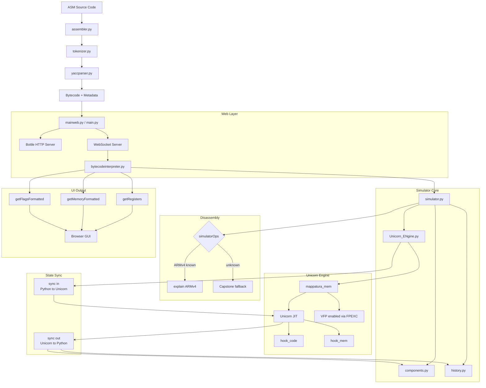

# ARMulator Unicorn
#### University of Rome Tor Vergata <br> BSc in Computer Science <br> A.Y. 2025/2026 - Computer Architecture <br> Prof. A. Simonetta, Eng. E. Iannaccone <br> Serena Stefani, Beatrice Principali, Angelo De Felice
#### [ARMulator Unicorn v2](https://github.com/amgelo00/ARMulator-unicorn-V2) is another version.

## 1. Introduction 

ARMmulator is a lightweight ARM emulator tool built on top of [Unicorn Engine](https://www.unicorn-engine.org/) powered by the [Capstone Disassembly Engine](http://www.capstone-engine.org/) and the [Keystone Assembly Engine](https://github.com/keystone-engine/keystone). It bridges the gap between assembly source code and hardware-level execution by integrating a custom assembler, memory management, and state history tracking.

### 1.1 About the project
Unicorn took QEMU's CPU emulation core and turned it into an embeddable library which can be controlled by API, by removing the bootloader, device emulation, OS, and anything else. It achieves high performance through the Just-In-Time (JIT) compiler technique. This means that ARM Bytecode is not interpreted instruction by instruction (as `simulator.py` from the original project did), but it is compiled at runtime into native code of the host machine.
The old version of ARMulator (based on epater) used a pure python interpreter: every instruction was decoded, analyzed and simulated in Python. This means that performance was slow and limited to ARMv4. With Unicorn the flow becomes :
1. `assembler.py` generates the ARM Bytecode just like before.
2. The new `Unicorn_ENgine.py` loads that bytecode into Unicorn, maps the memory, and configures the registers.
3. Unicorn runs the code using native JIT compilation, exposing hooks that intercept each instruction, memory access, and interrupt — used to update the GUI state and manage debugging.
4. **Keystone** begun the `disassembler` for instructions newer than ARMv4.
5. **Capstone** begun the `assembler` for instructions newer than ARMv4.

### 1.2 Supported Architectures
Unicorn generally supports ARM, ARM64 (ARMv8), m68k, MIPS, PowerPC, RISC-V, S390x (SystemZ), SPARC, TriCore and x86 (including x86_64). 
In fact the previous project was stuck on ARMv4, but with Unicorn now it could support ARMv7.

### 1.3 Main Changes
- Updated dependencies in the `requirements.txt`.
- Created a new engine `Unicorn_ENgine.py` with **Unicorn**.
- Created a new `main.py` as the CLI entry point.
- `simulator.py` acts as an orchestrator, `simulatorOps` handles the `explain()` part on ARMv4, **Capstone** converts bytecode back into assembly text, **Keystone** converts assembly text into bytecode, and `Unicorn_ENgine.py` however is responsible for fetching (`fetch()`) and  (`decode()`).
- PC (Program Counter) in the old version was manually updated, now Unicorn handles it.
- Now compatible with macOS

### 1.4 ARMulator (Original) VS ARMulator Unicorn

| Aspect | ARMulator (original) | ARMulator-Unicorn |
|---|---|---|
| **Instruction execution** | Pure Python interpreter, one instruction at a time | Unicorn JIT (native C), much faster |
| **Who executes** | `simulator.py` + `simulatorOps/` | `Unicorn_ENgine.py` (UnicornEmulator) |
| **Instruction decoding** | `bytecodeToInstr()` manually analyzes bits in Python | Unicorn internally, automatic |
| **PC update** | Manual in Python after each instruction | Unicorn updates it automatically |
| **Role of `simulator.py`** | Engine + orchestrator (did everything) | Orchestrator only (delegates execution) |
| **`simulatorOps`** | Used for decoding + execution + disassembly on ARMv4 | Used only for GUI disassembly on ARMv4 instructions |
| **Disassembly (unknown instructions)** | Not supported, error returned | Capstone fallback in `explainInstruction()` |
| **Assembly (unknown instructions)** | Not supported, syntax error returned | Keystone fallback in `assembler.py` (future) |
| **Breakpoints** | Managed entirely in Python | Managed via Unicorn hooks (`hook_code`, `hook_mem`) |
| **IRQ/FIQ interrupts** | Managed in Python | Still managed in Python (Unicorn does not support them natively) |
| **CPU state sync** | Not needed (everything in Python) | Required at every step (sync in → execute → sync out) |
| **History/reverse debug** | Recorded directly in Python | Recorded after sync out, comparing byte by byte |
| **ARM compatibility** | ARMv4 only | ARMv4 + partial ARMv7 via Unicorn + Capstone + Keystone |
| **VFP/Floating point** | Not supported | Enabled via FPEXC register initialization in Unicorn |
| **Portability** | Issues on macOS | Windows, Linux, macOS supported by Unicorn |
| **Speed** | Slow (everything interpreted in Python) | Much faster (native JIT) |


## 2.Architecture Overview

### 2.1 Project structure
``` Plaintext
ARMulator-Unicorn/
│
├── assembler.py                                # ARM Source → Bytecode compiler
│                                               # Falls back to Keystone Engine for
│                                               # unsupported instructions (ARMv7, VFP)
│
├── bytecodeinterpreter.py                      # Middleware (UI logic, breakpoints, state)
│
├── components.py                               # Hardware components (Registers, Memory, Flags)
├── generadoc.bat
├── history.py                                  # Execution history for reverse-debugging
├── howitworks.jpg
├── __init__.py                                 
├── interface                                   # Web Frontend (HTML/JS/CSS)
├── LICENSE
├── main.py                                     # CLI Entry point
│
├── mainweb.py                                  # Web Entry Point (Bottle server + WebSockets)
├── manuale.pdf
├── Unicorn_ENgine.py                           # ← NEW CORE FILE
│                                               # Replaces the legacy simulator with Unicorn.
│                                               # Manages memory mapping, hooks, step(),
│                                               # reset() and VFP/floating point support.
│                                               # Enables CP10/CP11 via FPEXC register.
│                                              
├── native_app.py                               # Desktop Wrapper (pywebview + Qt)
├── parser.out
├── parsetab.py                                 # Tables generated by PLY.
├── pdoc-docs
├── profile-data
│
├── README.md
├── requirements.txt
├── samples                                     # Example ARM Assembly files
│
├── settings.py                                 # Global configurations and constants.
│
├── simulatorOps                                # ARM instruction decoding (ARMv4 only).
│                                               # Base class + ExecutionException definition.
│                                               # Instruction metadata for the parser.
│                                               # BranchOp, DataOp, MemOp, etc.
│                                               # Falls back to Capstone disassembler for
│                                               # unsupported instructions (ARMv7, VFP).
│
├── simulator.py                                # Orchestrator (kept for internal use by
│                                               # BCInterpreter). Execution delegated to
│                                               # Unicorn_ENgine.py. Integrates Capstone
│                                               # fallback for unknown instruction disassembly.
├── stateManager.py
├── tests
├── teststep.py                                 # Instruction-level validation script.
│                                               # Used to verify the synchronization between
│                                               # Unicorn's internal state and the custom
│                                               # Register/History components.
│
├── tokenizer.py                                # ARM Lexical analyzer
├── translation
├── utils                                       # Miscellaneous utility functions.
├── wsgi.py
└── yaccparser.py                               # ARM Grammar Parser (PLY-based)
```

### 2.2 Memory Map

| Segment | Variable Name | Purpose | 
| ------- | ------------- | ------- |
| **INTVEC** | `INTVEC_ADDR` | Interupt Vector Table storage |
| **CODE** | `CODE_ADDR` | Executable machine instructions |
| **DATA** | `DATA_ADDR` | Static data and variable storage |


## 3. Installation & Requirements   

### 3.1 System Requirements
- Windows 11 or any Linux distribution
- Python from `3.7` to `3.13` (for Developers)

#### Installation
##### **Linux**

```bash
sudo apt update && sudo apt install python3-full python3-venv git -y 
chmod +x run.sh
./run.sh
```

##### **macOS**
```bash
/bin/bash -c "$(curl -fsSL https://raw.githubusercontent.com/Homebrew/install/HEAD/install.sh)" # if you don't have homebrew
brew install python
chmod +x run.sh
./run.sh
```

##### **Windows**
1. Install Python 3.12+ (from the Microsoft Store or python.org).
**Important**: During installation, make sure to check the box "Add python.exe to PATH".
2. Double-click `run.bat` to run the application.

#### Developer Installation
```plaintext
git clone https://github.com/USERNAME/REPO_NAME
pip install -r requirements.txt
```


## 4. Usage (for developer)
1. Download the .zip file from project repository in GitHub.

2. Open it.

3. Create Virtual Environment `venv`:
- **Linux / macOS**

```Plaintext
python3.12 -m venv env_name
source env_name/bin/activate
```
- **Windows**

```Plaintext
python3.12 -m venv env_name
env_name\Scripts\activate
```

4. Install all the *requirements*:

```Plaintext
pip install -r requirements.txt
```

5. Use this command from the terminal to start the emulator and open the GUI:
- **Linux / MacOS**
```Plaintext
python3 mainweb.py
```
- **Windows**
```Plaintext
python mainweb.py
```

### 4.1. Troubleshooting
This section describes the most common issues encountered during the setup and execution of the project, along with their causes and step-by-step solutions.


#### ERROR 1: Ports Already in Use (`OSError: [Errno 98]`)
The server fails to start and throws one of the following errors in the terminal:
```bash
OSError: [Errno 98] Address already in use: ('0.0.0.0', 8000)
OSError: [Errno 98] error while attempting to bind on address ('0.0.0.0', 31415)
```

- **Cause**: The ports required by the server (8000 and 31415) are already occupied by other active processes or by a previous instance of the program running in the background.

- **Resolution**:
    1. Identify the Process ID (PID) occupying the target port:
    ```bash
    sudo lsof -i:8000
    sudo lsof -i:31415
    ```

    2. Manually terminate the process using its PID:

    ```bash
    kill -9 <PID>
    ```
    `Example: kill -9 16698`

    3. Alternatively, force-kill all instances related to the main script:

    ```bash
    pkill -f mainweb.py
    ```

#### ERROR 2: Virtual Environment (venv) Corruption or Misconfiguration
During package installation, the process fails with an error similar to:

```bash
ERROR: Could not install packages due to an OSError:
[Errno 20] Not a directory: '/path/name/folder/ARMulator-Unicorn/venv/lib64/python3.12'
```

- **Cause**: The virtual environment (venv) has become corrupted, contains an internal error, or was incorrectly generated.

- **Resolution**: You need to completely recreate the virtual environment:

    1. Deactivate the current virtual environment:
    ```bash
    deactivate
    ```

    2. Remove the corrupted venv folder:
    ```bash
    rm -rf venv
    ```
    
    3. Recreate the virtual environment (make sure to explicitly use your specific Python version):
    ```bash
    python3.xx -m venv venv
    ```

    4. Activate the newly created virtual environment:
    ```bash
    source venv/bin/activate
    ```

    5. Reinstall all the required project dependencies:
    ```bash
    pip install -r requirements.txt
    ```

#### ERROR 3: "Current Instruction" Window is Missing / Not Visible
The dedicated UI panel that explains the current instruction is cut off or completely invisible.

- **Cause**: The display being used has a lower resolution (e.g., 1366x768) than the standard Full HD (1920x1080) layout for which the interface was optimized.

- **Temporary Workaround**: You do not need to change your monitor's hardware resolution. Simply lower your operating system's display scaling setting (for example, from 100% down to 75%). This will free up enough screen real estate to fully render and display the hidden window.

### 4.2 Known Bugs
#### Run + Step Button Issue
- **Bug Description**: Clicking the Run button to execute the project prevents the Step button from properly stepping through the code sequence afterwards.

- **Workaround**: To view individual code steps after having pressed Run, you must follow this exact sequence:

    1. Click the Stop button.

    2. Click the Assemble button again.

    3. Click the Step button to resume step-by-step execution.


## 5. How It Works


## 6. Future Developments
1. Add Thumb mode support.
2. Add coprocessor instruction support (CDP, MRC, MCR) leveraging Unicorn's built-in ARM coprocessor emulation.
3. Further optimize GUI updates and prevent passive behavior (currently uses jQuery code to react to WebSocket messages).
4. Translate the manuale or produce a new one.
5. Fix shallow copy bug in Memory.initdata to ensure correct state restoration on reset.
6. Create a standalone executable (.exe / binary) using PyInstaller to simplify distribution and avoid manual dependency installation.
7. Refactor the Code Export feature (`mainweb.py` / GUI).
8. Fix the `explain()` part of the GUI.

## 7. License and Acknowledgements
This project was developed as a final assignment for the [Computer Science](http://www.informatica.uniroma2.it) degree program at the University of Rome Tor Vergata.
It is based on [ARMulator](https://github.com/Filippo2903/ARMulator), originally developed by Filippo Gentili, Thomas Infascelli, Matteo Sorvillo, Alessandro Stella, which in turn is based on [Epater](https://github.com/mgard/epater), developed by Marc-André Gardner, Yannick Hold-Geoffroy, and Jean-François Lalonde.
